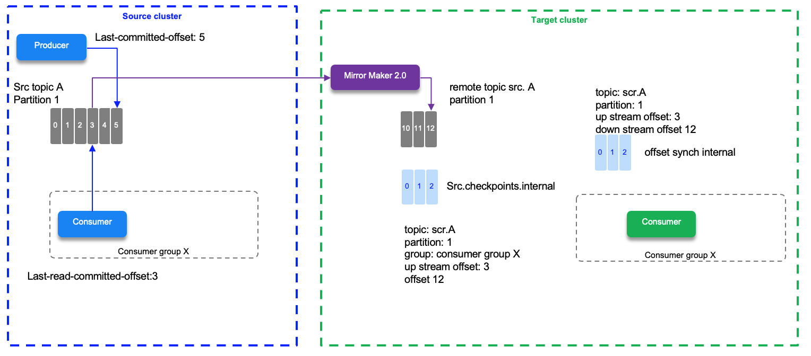
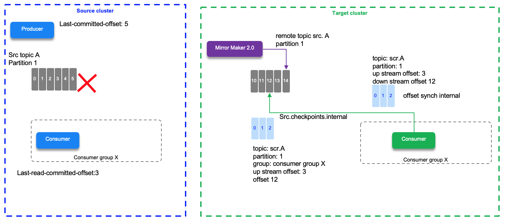

# Replication considerations

## Why replicating

The classical needs for replication between clusters can be bullet listed as:

* Disaster recovery when one secondary cluster is passive while the producer and consumers are on the active cluster in the primary data center: The following article goes over those principals.
* Active active cluster mirroring for inter services communication: consumers and producers are on both side and consumer or produce to their local cluster.
* Moving data to read only cluster as a front door to data lake, or to do cross data centers aggregation on the different event streams: Fan-in to get holistic data view.
* GDPR compliance to isolate data in country and geography
* Hybrid cloud operations to share data between on-premise cluster and managed service clusters.

## Topic metadata replication

It is possible to disable the topic metadata replication (The configuration is ``). We do not encourage to do so. Per design topic can be added dynamically, specially when developing with Kafka Streams where intermediate topics are created, and topic configuration can be altered to increase the number of partitions. Changes to the source topic are dynamically propagated to the target avoiding maintenance nightmare.
By synchronizing configuration properties, the need for rebalancing is reduced.

When doing manual configuration, even if the initial topic configuration was duplicated, any dynamic changes to the topic properties are not going to be automatically propagate and the administrator needs to change the target topic. If the throughput on the source topic has increase and the number of partition was increased to support the load, then the target cluster will not have the same downstream capability which may lead to overloading (disk space or memory capavity).

Also if the consumer of a partition is expecting to process the event in order within the partition, then changing the number of partition between source and target will make the ordering not valid any more. 

Also if the replication factor are set differently between the two clusters then the availability guarantees of the replicated data may be impacted and bad settings with broker failure will lead to data lost. 

Finally it is important to consider that changes to topic configuration triggers a consumer rebalance which stalls the mirroring process and creates a backlog in the pipeline and increases the end to end latency observed by the downstream application.


## Naming convention

Mirror maker 2 prefix the name of the replicated topic with the name of the source cluster. This is an important and simple solution to avoid infinite loop when doing bi-directional mirroring. At the consumer side the subscribe() function support regular expression for topic name. So a code like:

```java
kafkaConsumer.subscribe("^.*accounts")
```

will listen to all the topics in the cluster having cluster name prefix and local `accounts` topics. This could be useful when we want to aggregate data from different data centers / clusters.

## Offset management

Mirror maker 2 track offset per consumer group. There are two topics created on the target cluster to manage the offset mapping between the source and target clusters and the checkpoints of the last committed offset in the source topic/partitions/consumer group. When a producer sends its record it gets the offset in the partition the record was saved.

In the diagram below we have a source topic/partition A with the last write offset done by a producer to be  5, and the last read committed offset by the consumer assigned to partition 1 being 3. The last replicated offset 3 is mapped as 12 in the target partition. offset # do not match between partitions.
So if the blue consumer needs to reconnect to the green target cluster it will read from the last committed offset which is 12 in this environment. This information is saved in the checkpoint topic.



Offset synch are emitted at the beginning of the replication and when there is a situation which leads that the numbering sequencing diverges. For example the normal behavior is increase the offset by one 2,3,4,5,6,7 is mapped to 12,13,14,15,16,... if the write operation for offset 20 at the source is a 17 on the target then MM 2 emits a new offset synch records to the offset-synch topic.

The checkpoint and offset_synch topics enable replication to be fully restored from the correct offset position on failover. 



## Record duplication

Exactly-once delivery is difficult to achieve in distributed system. In the case of Kafka producer, brokers, and consumers are working together to ensure only one message is processed end to end. With coding practice and configuration, within a unique cluster, Kafka can guarantee exactly once processing. No duplication between producer and broker, and committed read on consumer side is not reprocessed in case of consumer restarts.

Cross cluster replications are traditionally based on at least once approach. Duplicate can happen when consumer task stops before committing its offset to the source topic. A restart will load records from the last committed offset which can generate duplicate. The following diagram illustrate this case:


As mirror maker is a generic consumer from a topic, it will not participate to a read-committed process, if the topic includes duplicate messages it will propagate to the target. 
But MM2 will be able to support exactly once by using the `checkpoint` topic on the target cluster to keep the state of the committed offset from the consumer side, and write with an atomic transaction between the target topic and the checkpoint topic.

## For consumer coding

We recommend to review the [producer implementation best practices](https://ibm-cloud-architecture.github.io/refarch-eda/kafka/producers/) and the [consumer considerations](https://ibm-cloud-architecture.github.io/refarch-eda/kafka/consumers/).

For platform sizing, the main metric to assess, is the number of partitions in the cluster to replicate. The number of partitions and number of brokers are somehow connected as getting a high number of partitions involves increasing the number of brokers. For Mirror Maker 2, as it is based on Kafka connect, there is a unique cluster and each partition mirroring is supported by a task within the JVM so the first constraint is the memory allocated to the container and the heap size.
