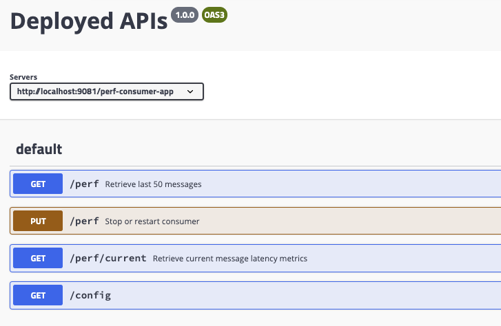

# Simple Kafka Consumer App

## Implementation approach

The approach is to implement producer and consumer to get the different timestamps to measure the latency of the data mirroring.


* ts-1: timestamp when creating the record object before sending
* ts-2: record timestamp when broker write to topic-partition: source topic
* ts-3: record timestamp when broker write to topic-partition: target topic
* ts-4: timestamp when polling the record

The consumer needs to be deployable on OpenShift to scale horizontally. The metrics can be exposed as metrics for Prometheus. The metrics are: average latency, min and max latencies.

The producer tool is just an simple java class and is not yet deployable as webapp.

## Building the consumer

To build the `PerfConsumerApp.war` we use maven.

```shell
mvn install
```

## Building the docker image

To build your image, make sure that your Docker daemon is running and execute the Docker `build` command
from the command line. If you execute your build from the same directory as your Dockerfile, you can
use the period character (`.`) notation to specify the location for the build context. Otherwise, use
the `-f` flag to point to your Dockerfile:

```shell
docker build -t ibmcase/perfconsumerapp .
```

The first build usually takes much longer to complete than subsequent builds because Docker needs to
download all dependencies that your image requires, including the parent image.

## Running your application in Docker container

Now that your image is built, execute the Docker `run` command should start the application with the properties as defined in the microprofile-config.properties:

```shell
docker run -d --name perfconsumerapp -p 9080:9080 -p 9443:9443 ibmcase/perfconsumerapp
```

To over write the default properties we can use environment variables. For example to connect to an on-premise cluster using TLS for authentication and authorization:

```shell
export KAFKA_TARGET_BROKERS=
export KAFKA_CERT=/home/truststore.jks

docker run -ti -e KAFKA_BROKERS=$KAFKA_TARGET_BROKERS -p 9081:9081 ibmcase/perfconsumerapp
```

## Testing the container

Before you access your application from the browser, run the `docker ps` command from the command line to make sure that your container is running and didn't crash:

```shell
$ docker ps
CONTAINER ID        IMAGE               CREATED             STATUS              NAMES
2720cea71700        ibmcase/perfconsumerapp          2 seconds ago       Up 1 second   perfconsumerapp
```

To view a full list of all available containers, run the `docker ps -a` command from the command line.

### Access to the APIs

Here is a quick view of the openapi: [http://localhost:9081/openapi/ui](http://localhost:9081/openapi/ui)



Get the metrics via API

```shell
http://localhost:9081/perf-consumer-app/perf/current

{ "Max-latency":51830729","Min-latency":51450505", "Average-latency":51698170}
```

Get application metrics like min, max, average latencies via the Prometheus metrics: **metrics/application**

```shell
# TYPE application_ibm_gse_eda_perf_consumer_app_PerfConsumerController_maxLatency_seconds gauge
application_ibm_gse_eda_perf_consumer_app_PerfConsumerController_maxLatency_seconds 1.9880879999999999
# TYPE application_ibm_gse_eda_perf_consumer_app_PerfConsumerController_averageLatency_seconds gauge
application_ibm_gse_eda_perf_consumer_app_PerfConsumerController_averageLatency_seconds 1.9878909999999999
# TYPE application_ibm_gse_eda_perf_consumer_app_PerfConsumerController_minLatency_seconds gauge
application_ibm_gse_eda_perf_consumer_app_PerfConsumerController_minLatency_seconds 1.9878099999999999
```

Get the configuration: [http://localhost:9081/perf-consumer-app/config](http://localhost:9081/perf-consumer-app/config)

```json
{
"key.deserializer": "org.apache.kafka.common.serialization.StringDeserializer","value.deserializer": "org.apache.kafka.common.serialization.StringDeserializer","enable.auto.commit": "false","group.id": "test-cons-group","bootstrap.servers": "localhost:29092,localhost:29093,localhost:29094","auto.offset.reset": "earliest","client.id": "test-cons-group-client-8980675c-fdc6-4991-95e0-793e4d487ce1"
}
```

## Deploy to Openshift

Here are the simple steps, some may  be skipped if you are already connected to your cluster:

1. To login to OpenShift by using the CLI, navigate to the online web console by following the [username] > Copy Login Command > Display Token > Log in with this token path.
1. Change to your target project or create a new project.
1. Log to the registry: `oc registry login`
1. Tag the docker images with the registry url and target project:

    ```shell
    docker tag perfconsumerapp:latest $(oc registry info)/$(oc project -q)/perfconsumerapp:1.0-SNAPSHOT
    docker push $(oc registry info)/$(oc project -q)/perfconsumerapp:1.0-SNAPSHOT
    ```
1. Change the deployment file with the app name and image name in the [k8s/deployment.yaml] file.
1. Deploy: `oc apply -f k8st/deployment.yaml`
1. Undeploy: `oc delete -f k8st/deployment.yaml`


## Using Kafdrop to look at the messages

[Kafdrop](https://hub.docker.com/r/obsidiandynamics/kafdrop)
